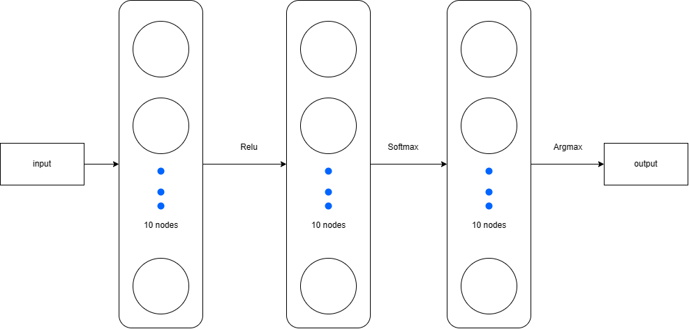
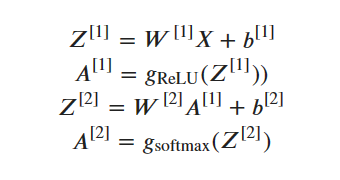
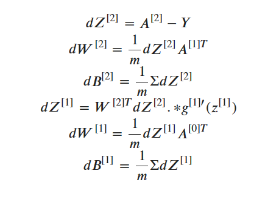

# Gurmukhi Handwritten Digit Classification Report(Building nueral network from scratch)
## Introduction
The objective of this project is to classify Gurmukhi handwritten digits using a Neural Network. The dataset used in this project consists of images of handwritten digits from 0 to 9, written in the Gurmukhi script. The neural network is build from scratch .

## Methodology
The project was implemented using Python 3. The neural network was implemented using the numpy and matplotlib libraries. The PIL library was used to process the images.

## Data Preparation
The dataset used in this project consists of two directories, train and test. The train directory contains the training data, which is used to train the neural network, and the test directory contains the test data, which is used to evaluate the performance of the neural network. Each directory contains ten subdirectories, one for each class of digit. Each image in the dataset is a grayscale image of size 32x32. The images were read in using the PIL library and converted to a numpy array. The pixels of each image were then flattened into a one-dimensional array. This resulted in a two-dimensional array where each row represents an image and each column represents a pixel.

## Neural Network Architecture
The neural network used in this project consists of an input layer with 1024 neurons (one for each pixel in the flattened image), two hidden layers, each with 10 neurons, and an output layer with 10 neurons, one for each class of digit. The activation function used in the hidden layers is the Rectified Linear Unit (ReLU) function, and the softmax function is used in the output layer to produce a probability distribution over the classes.

### Architecture

### Fordware Progagation

### Backward propagation

## Training
The neural network was trained using backpropagation . The weights of the neural network were initialized with random values between -0.5 and 0.5. The learning rate used in the training process was 0.1, and the number of iterations was set to 5000,but it will stop if the train accuracy touches 100 before reaching 5000. The training data was shuffled before each epoch to prevent the network from learning the order of the training data. The accuracy of the neural network was evaluated on the test data after each epoch.

## Results
The accuracy of the neural network on the train data was 100% after 4000 iterations, so it stopped training . The accuracy of the neural network on the test data was 94.9% after 4000 iterations. The network was able to achieve a high level of accuracy on the test data, which indicates that it was able to generalize well to unseen data.

## Conclusion
The project demonstrates that a neural network can be used to classify Gurmukhi handwritten digits with high accuracy. The accuracy achieved by the neural network on the test data indicates that it can be used in practical applications. The project can be further extended by using more advanced neural network architectures and optimization algorithms to improve the accuracy of the network.

